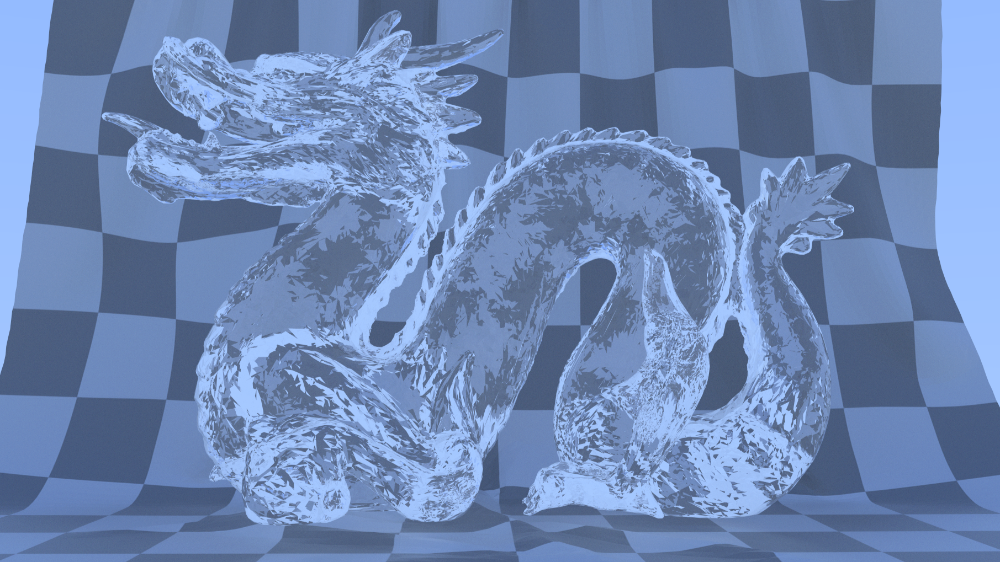

# Ray Tracer :)

> **A GPU-accelerated ray tracing engine implementing the Disney Principled BSDF, built with Rust and Vulkan**

## 🔆 Features

- **Physically-based rendering** using path tracing
- **Disney Principled BSDF** for realistic material rendering
- **GPU acceleration** through Vulkan compute shaders
- **High-performance BVH** scene acceleration structure 
- **Skybox support** with HDR image-based lighting
- **Multi-bounce light transport** for global illumination
- **Efficient scene loading** from YAML configuration
- **AI Denoising** from Intel Open Ai Denoising

## 📋 Contents

- [🔆 Features](#-features)
- [📋 Contents](#-contents)
- [🖼️ Gallery](#️-gallery)
- [📄 Scene Format](#-scene-format)
- [🎨 Materials System](#-materials-system)
- [🚀 Building and Running](#-building-and-running)
- [💻 Technologies](#-technologies)
- [🏢 Architecture](#-architecture)
- [🔥 Performance](#-performance)
- [🔮 Future Work](#-future-work)
- [📚 References](#-references)

## 🖼️ Gallery



*Dragon without normal smoothing*


*Dragon with normal smoothing*


*Roughness from 0..1*


*metallic from 0..1*

## 📄 Scene Format

```yaml
camera:
  resolution: [900, 900]
  focal_length: 2.1
  focus_distance: 1
  aperture_radius: 0
  location: [8, 25, 30]
  look_at: [0, 5, 0]

skybox: [
  "data/skybox/px.png",
  "data/skybox/nx.png",
  "data/skybox/py.png",
  "data/skybox/ny.png",
  "data/skybox/pz.png",
  "data/skybox/nz.png",
]

materials:
  MetallicMaterial:
    base_colour: [0.8, 0.8, 0.9]
    metallic: 0.9
    roughness: 0.2
    specular_tint: 0.5
    
  GlassMaterial:
    base_colour: [1.0, 1.0, 1.0]  
    roughness: 0.05
    spec_trans: 0.95
    ior: 1.5
    
surfaces:
  - type: "object"
    smooth: true
    file: "data/models/sphere.obj"
    material: "MetallicMaterial"
    
  - type: mesh
    material: "GlassMaterial"
    vertices:
      - [-10, 0, -10]
      - [10, 0, -10]
      - [10, 0, 10]
      - [-10, 0, 10]
    triangles:
      - [0, 1, 2]
      - [0, 2, 3]
```

### Scene Definition Structure

| Section | Description |
|---------|-------------|
| `camera` | Camera parameters like position, orientation, and lens settings |
| `skybox` | Paths to the 6 cubemap faces for environment lighting |
| `materials` | Named material definitions using the Disney BSDF parameters |
| `surfaces` | Geometry definitions, either from OBJ files or inline meshes |

## 🎨 Materials System

Implements the full Disney Principled BSDF with these parameters:

| Parameter | Description | Default |
|-----------|-------------|---------|
| `base_colour` | Base surface color (diffuse or metallic) | `[0.8, 0.8, 0.8]` |
| `emission` | Light emission (for emissive materials) | `[0.0, 0.0, 0.0]` |
| `metallic` | Metallic reflection (0=dielectric, 1=metallic) | `0.0` |
| `roughness` | Surface microfacet roughness | `0.5` |
| `subsurface` | Subsurface scattering amount | `0.0` |
| `anisotropic` | Anisotropic reflection | `0.0` |
| `specular_tint` | Tints the specular reflection | `0.0` |
| `sheen` | Sheen for cloth-like materials | `0.0` |
| `sheen_tint` | Tints the sheen component | `0.5` |
| `clearcoat` | Clear coat layer | `0.0` |
| `clearcoat_roughness` | Roughness of clear coat | `0.03` |
| `spec_trans` | Specular transmission | `0.0` |
| `ior` | Index of refraction | `1.45` |

## 🚀 Building and Running

### Requirements

- MSRV
- Vulkan SDK 1.2+
- Cargo and standard Rust toolchain
- OIDN 2.2+

### Building

```bash
# Clone the repository
git clone https://github.com/teehee567/ray-tracer
cd ray-tracer

# Build in release mode
cargo build --release
```

### Running

```pwsh
# Run with a default scene
cargo run --release -- scenes/default_scene.yaml

# Or specify a custom scene
cargo run --release -- path/to/your/scene.yaml
```

## 💻 Technologies

### Core Technologies
- **Rust**: Memory safety and performance for the CPU side
- **Vulkan**: Low-level GPU access through compute shaders
- **GLSL**: Shader implementation of the core ray tracing algorithm

### Key Libraries
- **ash**: Safe Rust bindings to Vulkan
- **glam**: Fast linear algebra library
- **serde**: Serialization/deserialization for scene loading

## 🏢 Architecture

The tracer is built on a hybrid CPU/GPU architecture:

- **CPU Side**: Scene loading, BVH construction, and coordination
- **GPU Side**: Ray tracing, shading, and image composition

The system consists of these major components:

### Scene Management

Scenes are loaded from YAML files that describe:

- Camera parameters
- Material properties and textures
- Geometry (triangles, meshes)
- Light sources
- Environmental lighting

### Acceleration Structure

A high-performance BVH (Bounding Volume Hierarchy) is constructed on the CPU and transferred to the GPU for efficient ray traversal:

- Surface area heuristic for optimal splits
- Fast parallel construction
- Compact memory representation

### Rendering Pipeline

The tracer employs a progressive rendering approach:

1. Primary ray generation from camera
2. BVH traversal for intersection tests
3. Material evaluation using the Disney BSDF
4. Direct light sampling with MIS (Multiple Importance Sampling)
5. Recursive path tracing for indirect illumination
6. Progressive refinement for noise reduction

## 🔥 Performance

The Ray Tracer achieves high performance through several optimizations:

- **BVH acceleration**: Efficiently culls non-intersecting geometry
- **Vulkan compute**: Utilizes modern GPU hardware

Typical performance on modern hardware (RTX 3080):
- **1080p**: 5-10 samples per second (full path tracing)
- **720p**: 10-20 samples per second

## 🔮 Future Work

- **Volumetric rendering**: Add support for participating media
- **Bidirectional path tracing**: Improve handling of difficult light paths
- **Interactive editing**: Real-time material and scene adjustments

## 📚 References

1. Disney Principled BSDF: [Physically-Based Shading at Disney](https://disney-animation.s3.amazonaws.com/library/s2012_pbs_disney_brdf_notes_v2.pdf)
2. Path Tracing: [Physically Based Rendering: From Theory To Implementation](https://www.pbr-book.org/)
3. BVH Construction: [On fast Construction of SAH-based Bounding Volume Hierarchies](https://graphics.stanford.edu/~boulos/papers/togbvh.pdf)
4. Blender Cycles ray tracer: [Blender Cycles renderer](https://projects.blender.org/blender/cycles)
5. GLSL Ray Tracer: [GLSL Ray Tracer](https://github.com/knightcrawler25/GLSL-PathTracer)
6. Caldera Ray Tracer: [Caldera Ray Tracer](https://github.com/sjb3d/caldera)
7. Ray Tracing in a weekend: [Ray Tracing in a weekend](https://raytracing.github.io/books/RayTracingInOneWeekend.html)
8. Graphics Codex: [Graphics Codex](https://graphicscodex.com/)
9. Alexander Veselov's Ray Tracver: [Ray Tracer](https://github.com/AlexanderVeselov/RayTracing)
